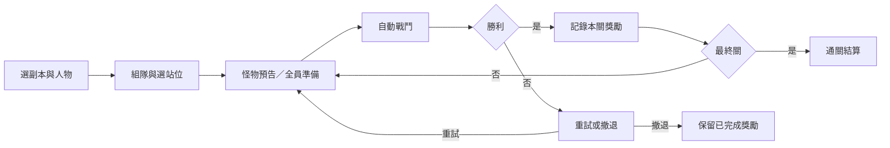

# 10/1 首發副本設計：失落鑄造所

> 已被取代：本稿為未獲確認的舊提案，停止作為開發依據。請以 [組隊企劃 V2](SEASON_2026_10_PARTY_PLAN_V2.md) 討論；本文保留供追溯。

> 2026/09/21 討論稿／尚未實作。已定方向：站位組隊、新怪與 BOSS、重要機制集中於此、錨點停用。以下名稱、人數、等級、機制及獎勵都是建議值，不是正式設定。
> 上位規格：[本季玩法](SEASON_2026_10_GAMEPLAY_PLAN.md)；交付追蹤：[開季清單](SEASON_2026_10_LAUNCH_CHECKLIST.md)。

## 1. 首發內容

先完成一座五關副本「失落鑄造所」：調查仍在自行運作的古代兵器工廠。三隻普通怪、一隻精英、一隻 BOSS，依序進行單敵戰鬥；小怪教規則，王綜合考驗。建議 Lv.30、3–6 人，一坦一補其餘輸出；含準備與戰報目標 10–15 分鐘，需實測。首發一種普通難度，困難版、競速、格子移動後續再做。

一般區提供基礎成長，副本提供組隊配裝、外觀及收藏追求，不把基本轉職與每日成長鎖在組隊後面。

## 2. 開始與推進方式

戰鬥頁 → 組隊副本 → 查看介紹、推薦配置、個人獎勵資格 → 建立公開／密碼房或加入 → 選出戰人物與站位 → 全員準備 → 隊長開始。

- 同帳號只能一個人物參戰，不能用人物欄位塞滿隊伍。開戰鎖定人物、裝備、成員與初始人數；外部換裝不改寫副本快照。
- 房間顯示等級、職業、HP、站位、實際治療／護盾能力及獎勵資格。選補位不會自動學會補血。
- 至少三人、全員準備才能開始；缺坦或有效治療時顯示具體提醒，允許自行挑戰，不硬鎖職業。
- 更動名單、配裝或站位後清除全員準備。隊長不能代按準備。
- 每關顯示怪物招式與對策；關間可以改職責與使用補給，不能換人物或整套裝備。全員準備後隊長開下一場。
- 戰鬥自動按速度結算；首發沒有戰中手動躲格或按鍵打斷。預告必須在開戰前可看見，戰報則解釋觸發結果。

## 3. 站位設計

畫面以「前排守護／中排攻擊／後排支援」表示職責，不設自由移動座標。職業提供技能，站位決定任務。

| 站位 | 實際作用提案 | 準備方向 |
| --- | --- | --- |
| 守護／坦 | 普攻與重擊優先打主坦；多坦時明選主坦與替補。倒地後按替補坦→輸出→支援接敵，同類依固定席次 | HP、防禦、減傷，穩定接重擊 |
| 支援／補 | 使用原有治療、護盾、增益；能力提示按實際效果判斷，戰報顯示有效治療與保護貢獻 | 有效團補或保護，不能只選補位 |
| 攻擊／輸出 | 集火目前敵人，在蓄力期間用傷害削弱招式；不設個人輸出上限 | 穩定輸出或爆發，保留生存能力 |

現有倍率：坦 HP×1.3／ATK×0.7／光環×0.5；補 HP×0.7／ATK×0.7／光環×1.3；輸出 ATK×1.2／光環×0.5。這是舊系統比較，不能直接當新季答案。建議先測支援不扣 HP，避免全體技首先懲罰補位；其餘倍率以零錨點職業樣本定案。

人數縮放初稿：怪物 HP = 三人基準 × [1 + 0.35 × (人數−3)]；三到六人依序 1／1.35／1.70／2.05 倍。技能每人傷害不隨人數加乘，離線退隊不縮血。需驗證三人可過、六人不至於失去挑戰。

## 4. 五關新怪與 BOSS

時序均以「怪物自己的行動次數」計算，避免隊伍速度與人数改變技能節奏。

| 關卡 | 機制提案 | 學習重點 |
| --- | --- | --- |
| 鐵殼哨兵 | 第 2 次行動預告，第 3 次重擊主坦，每三次行動循環 | 坦接招、補照顧坦；不疊破甲或即死 |
| 灰燼司爐者 | 每第 3 次行動全體熱浪，其餘普攻；不追加持續燒傷 | 全隊要有生存與恢復能力 |
| 蓄能獵械 | 第 2 次行動蓄力，第 4 次釋放；期間受到最大 HP 的 12% 傷害則招式減半傷害 | 輸出削弱群傷，失敗不直接判全滅；仍可提前擊殺 |
| 鍛爐督軍（精英） | 六次行動循環：普攻→重擊預告→重擊→普攻→熱浪預告→熱浪 | 交替使用已學規則，不新增系統 |
| 熔爐監督者（BOSS） | 原循環同精英；HP 首次低於 50% 後，下次行動開始最終蓄能，兩個自身行動間隔後釋放。期間受到最大 HP 的 10% 傷害則減半傷害 | 坦接重擊、補撐群傷、輸出削弱爆發；不回血或強制無敵 |

同一行動只出一招。BOSS 轉階段優先，取代原排程，蓄能結束後重開原循環；轉階段僅一次。削弱只計蓄力開始到釋放前的有效傷害，敵人死亡立即勝利。

傷害調校目標：合理配裝主坦能吃一次重擊，滿血非坦能吃一次熱浪，蓄能未削弱造成明顯壓力但不必然全滅。正式 HP、ATK、技能係數需用零錨點三人／六人樣本推定，不能單憑紙面數字決定。

## 5. 補給、失敗與斷線

- 勝利後存活者回復最大 HP 的 30%，倒地者以 30% HP 復起；關間可消耗允許的既有治療道具。
- 全滅或行動預算耗盡算本關失敗。全隊滿血回到本關準備，可重試；已用道具不退，已過關不能重刷獎。
- 撤退保留已完成關卡獎勵，沒有 BOSS 通關獎。開戰後不補新隊員。
- 斷線不等於退隊，進行中自動戰鬥照常完成；關間等重連。準備階段無操作 15 分鐘結束，結算已完成關卡；隊長離線 2 分鐘允許在線成員接任。
- 重啟後恢復已完成關卡與確認消耗；未結算戰鬥從持久紀錄恢復或回戰前，不能重扣道具或重發獎勵。這是待新增能力。
- 戰報解釋死亡、有效治療、蓄能削弱成敗，讓玩家知道下次要調整什麼。

## 6. 個人獎勵與保底

每人獨立領，不擲骰搶裝、不按 DPS 分配；通關時倒地仍有同等資格。

| 來源 | 每位有資格玩家的獎勵初稿 |
| --- | --- |
| 三隻普通怪 | 每關 1 枚鑄造徽記，共 3 枚 |
| 精英 | 2 枚徽記 |
| BOSS | 5 枚徽記；另有 20% 個人機率掉 1 件副本裝備 |
| 帳號首次完整通關 | 收藏稱號「熄爐者」，不加戰力 |
| 兌換 | 30 枚自選 1 件裝備，100 枚限定外觀 |

一趟保底 10 枚，三次有獎通關能自選一件。初稿不額外發大量金幣／EXP，副本怪不沿用一般怪掉落表。隨機裝備在三件中等機率抽取、可重複，保底兌換負責補缺；刷新不重抽。

首發三件方向：守爐盾飾（生存）、司爐護符（治療／保護）、獵械徽章（輸出）。使用既有裝備欄位，不新增錨點或三套套裝系統；確切欄位、屬性與被動對照現有模型另定。同強化水準的總戰力預算接近同級稀有裝備，以配裝差異提供價值。

徽記及裝備建議不可交易、帳號共用、依季節物品規則換季；稱號與外觀建議永久收藏，必須先納入保留規則才上線。兌換不提供拆解返還徽記，避免循環套利。

### 獎勵資格

每帳號每天三次，台北時間 05:00 更新；開始預留一次，首關成功才消耗，首關前撤退釋放預留。取得任何關卡獎勵後撤退仍算一次，跨日副本沿用開始日資格。所有人物共用，超過次數可陪打或練習，但沒有徽記、隨機裝備或其他經濟獎勵；首次通關收藏仍只發一次。

陪打與有資格玩家可以同隊，開始前各自標示。每關以副本＋帳號＋關卡唯一識別，兌換亦須防重複。背包滿記錄待領，不丟獎；切人物、刷新、換隊長、重連、重試均不能多領。

## 7. 現況與實作 LIST

已核對現有 `towerPartyRooms.js` 有房間、選位、隊長推關與道具；`towerRoles.js` 有倍率及選敵順序；`towerHandlers.js` 是速度軸、逐場單敵自動結算。`towerConfig.js` 是舊 71 層、Lv.30、六人設定。房間仍在記憶體、沒有全員準備及完整持久獎勵防重。新副本應獨立設定並重用共用能力，保留舊塔資料。

- [ ] D01 確認主題、3–6 人、Lv.30、五關及首發難度。
- [ ] D02 持久房間、人物快照、全員準備、主坦、能力提示、重連與隊長接任。
- [ ] D03 技能預告、個體行動計數、蓄能累計、轉階段與戰報。
- [ ] D04 五隻新怪資料與美術，獨立於既有世界王設定。
- [ ] D05 關間補給、重試、道具消耗防重、副本外狀態隔離。
- [ ] D06 每日資格、個人結算、待領、三件裝備、徽記與兌換。
- [ ] D07 零錨點平衡：三／六人、缺補、雙坦、高輸出、倒地與換位。
- [ ] D08 實際多人驗收：跨日、重啟、重連、滿包、重複請求、切人物及撤退。
- [ ] D09 Web／Discord 入口與規則一致、正式資料上架及開季驗收。

建議優先討論：自動戰鬥＋關間選位是否符合期待；三人開打是否好揪團；獎勵採每日三次或每週共用額度。這三點定下來後再鎖定数值。
