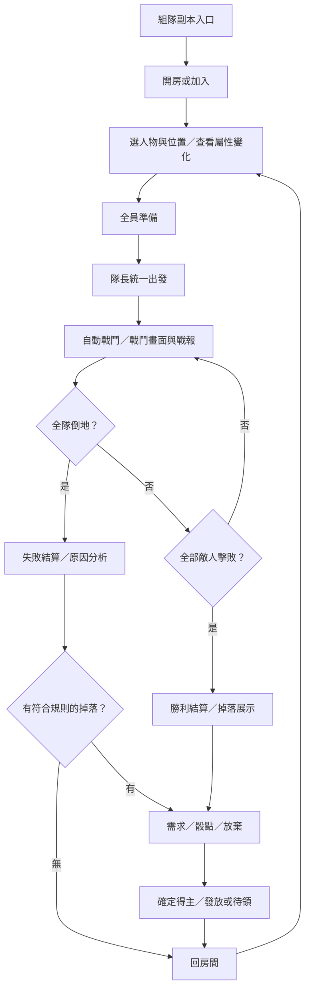
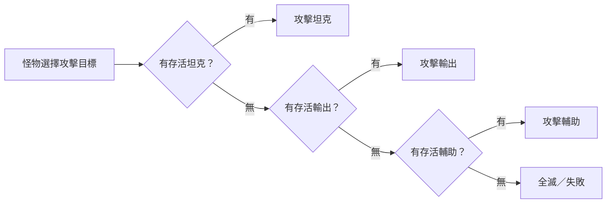

# 新季度組隊副本企劃 V2：站位加成、自動戰鬥與骰裝

> 提案／未實作。2026/09/21 依使用者最新說明重寫；本次只完成企劃，須看完討論後才實作。
> 「已確認」表示使用者指定的玩法方向，不表示遊戲已支援。「建議」與「待定」都尚未獲定案。
> 本稿取代舊《失落鑄造所》作為組隊企劃的討論基礎；不沿用其五關、Lv.30、每日三次、徽記、個人裝備掉落或手動／自動保護策略。

## 一、玩法定位與已確認規則

玩家帶自己的角色開房組隊，選坦克／輸出／輔助位置，取得不同屬性調整。全員準備後由隊長統一出發，系統自動戰鬥，提供戰鬥畫面與戰報。怪物比基本內容有較高血量與傷害，優先攻擊坦克，坦克全倒才攻擊輸出，最後攻擊輔助。單一隊員倒地不結束，整隊全滅才判敗，並說明大致原因。掉落較好道具，在結算窗口決定誰需要、骰點分配。

本季整體定位：一般區與原有世界王簡化，組隊區承接新怪、BOSS 與重要機制；錨點暫停。

## 二、從入場到結算

1. 玩家進入組隊入口，查看可挑戰副本的推薦戰力、主要掉落與預估時間。人數、等級、費用、次數先列待定，不沿用舊提案數字。
2. 建立房間或加入房間。建議提供公開列表與房號／密碼加入，隊長可邀請、移除未出發成員。
3. 每人選擇出戰人物、位置；畫面即時顯示套用後 HP、防禦、傷害、迴避、治療與光環變化，不能只顯示抽象職責。
4. 全員各自按準備；名單、人物、裝備或站位變動時，建議取消全員準備，避免資料不一致。隊長統一出發。
5. 出發後自動進行攻擊、治療、光環及怪物行動；玩家看戰鬥動畫與同步戰報。建議鎖定人物、裝備、位置及成員，不要求逐關重新按準備。
6. 怪物依坦克→輸出→輔助挑選存活目標；有人倒地仍繼續，直到本場敵人被擊敗或全隊倒地。
7. 若設計多波怪物，建議自動接續下一波；是否單一 BOSS 或多波、跨波是否回血仍待定。
8. 完成全部敵人即勝利；全員倒地即失敗。兩者都進結算，失敗顯示原因，若存在合格掉落則進分配。
9. 在結算窗口逐件選需求／骰點／放棄，顯示得主並發放。建議結算完成回原房間，準備後可再次出發。

## 三、玩法構圖





## 四、站位與屬性

| 位置 | 已確認增加 | 已確認降低 | 戰鬥定位 |
| --- | --- | --- | --- |
| 坦克 | 防禦、最大 HP | 傷害 | 第一受攻順位，爭取全隊輸出時間 |
| 輸出 | 傷害 | 防禦、迴避、最大 HP | 坦克之後受攻，以脆弱換取火力 |
| 輔助 | 最大 HP、輔助光環、補血等能力 | 防禦 | 最後受攻，維持團隊續戰 |

倍率尚未定案。尤其輔助 HP 是增加，不能沿用舊程式補位 HP 降低的設定。傷害應涵蓋實際相關傷害路徑，不能只提高 ATK 卻漏掉技能；防禦包含哪些物理／魔法項目、迴避採乘算或減百分點、護盾是否納入輔助增幅，都要先列清楚再實作。

建議用「原有職業與裝備能力 × 副本站位修正」計算，離開副本即移除，不污染一般區或人物永久資料。不先新增每人都有的補血技，也不把選輔助解釋成轉職；缺少實際輔助能力時，房間如實提示。

同位置多人時的規則尚待確認。建議以房間固定席次決定誰先承傷，同排第一人倒地才換下一人，選位畫面直接顯示受攻順序。若首發只准一坦或一輔助，需另確認，不能暗中鎖死名額。

示意（席次數量只為說明，不代表人數上限）：

```text
                   怪物
                    ↓
        前排： [坦克 A] [坦克 B]
                    ↓ 前排全倒
        中排： [輸出 C] [輸出 D]
                    ↓ 中排全倒
        後排： [輔助 E] [輔助 F]
```

## 五、自動戰鬥與技能如何運作

- 已確認：戰鬥自動進行，站位建立承傷順序與屬性差異。玩家不是等怪物提示後手動換位或按防禦。
- 坦克靠提高的防禦與 HP 承傷；輔助靠角色既有自動治療、光環等能力延長續戰，輸出趁前排尚存時擊殺敵人。
- 治療選誰、何時觸發，沿用或整合既有技能定義；若現有技能無法對隊友生效，這是要補的功能，不能宣稱站位本身已解決。
- 額外建議：無指定目標的單體自動治療選存活且 HP 比例最低者，同值依固定席次；團補照技能範圍。此規則待確認，不是新增可選 AI 策略。
- 倒地者建議停止攻擊、治療與自身維持的光環；已施放且有獨立時效的效果依技能規則到期。復活是否可用待定，首發可先不加入新復活機制。
- 受攻順序已確認，首發怪物不自行加入越過前排的後排點名、隨機打人或全體傷害。若要例外機制必須另外討論，不能破壞站位承諾。
- 達到完整勝利條件仍須結束；「全滅才結束」在本稿解釋為單人死亡不判敗、不以任意回合耗盡判敗。完全無法造成傷害等異常應安全中止並標示異常，不能無限運算或假裝正常全滅。異常中止及返還規則實作前另定。

## 六、怪物與副本內容設計

已確認怪物 HP、傷害比基本內容高，掉落更好；具體倍數、數量與波次待定，需依零錨點隊伍測試。人數增加是否縮放亦待定，不能直接把舊塔參數當定案。

先用怪物功能原型討論，不沿用先前未確認的副本名稱與五關順序：

| 原型（建議） | 特性 | 檢驗的隊伍能力 |
| --- | --- | --- |
| 重裝守衛 | 高血量，穩定攻擊當前前排 | 坦是否撐得住、隊伍續航是否足夠 |
| 猛攻獸 | HP 相對少，攻擊壓力较高 | 輸出能否在坦倒下前擊殺 |
| 堅甲魔像 | 防禦較高，不設強制無敵 | 配裝與有效傷害是否足夠 |
| 區域 BOSS | 更高 HP／傷害，可有週期重擊當前目標 | 坦、防禦、治療與輸出的整體搭配 |

新怪、新 BOSS 要有自己的資料、造型與掉落表。首發機制應能由既有自動技能與站位應對，例如對當前目標的重擊；需要手動閃避、戰中換位、限時點按的機制不納入此版。

平衡方向：合理坦位有明顯生存提升；輔助提高續航但不無限拖戰；輸出提高擊殺效率但坦倒後有風險。不可只提高怪物傷害到一次秒坦，讓站位加成失去意義。

## 七、戰鬥畫面與結算構圖

```text
【副本名稱】                 【進度／戰鬥狀態】
怪物形象　名稱　HP ███████░░░　狀態

前排　坦 A：HP／護盾／狀態　　坦 B：HP／狀態
中排　輸出 C：HP／狀態　　　 輸出 D：HP／狀態
後排　輔助 E：HP／狀態

目前受攻目標：坦 A
戰報：怪物攻擊 → 減傷／護盾 → 扣血 → 治療與技能觸發
```

```text
【勝利／全滅】　經過時間　擊敗敵人　存活／倒地
隊伍表現：傷害｜承受傷害｜有效治療｜保護與增益
失敗提示（敗北時）：可核對的原因＋配置改善方向

掉落：裝備甲　屬性與裝備條件　目前選擇狀態
[需求] [骰點] [放棄]　　等待分配／倒數
結果：玩家 C 需求 82 點 → 獲得裝備甲
[待領道具]　[回房間]
```

手機可將三排直向顯示。倒地保留人物與清楚狀態，不能讓玩家誤以為被踢出隊伍。戰報與動畫共用同一個結果，不因播放速度或斷線而重算。

## 八、全滅原因分析

已確認要說明大概失敗原因。建議呈現隊伍問題，不公開責怪單一玩家。分析根據本場事件，不編造百分比改善保證。

| 可觀察證據 | 可以顯示的解釋 |
| --- | --- |
| 坦在前段便倒地、單次承傷占其 HP 很高 | 前排承傷壓力大，可檢查坦位 HP、防禦與裝備 |
| 治療低於承傷、技能有大量冷卻／資源不足 | 恢復跟不上，可檢查輔助能力與技能運作 |
| 全滅時怪物仍有大量 HP | 擊殺速度不足，或前排過早倒下導致輸出中斷，需合併時間軸判断 |
| 坦倒下後，低防低血輸出快速連倒 | 前排失守形成連鎖死亡；顯示轉移目標的時間線 |
| 沒選坦、輸出從一開始直接受攻 | 缺乏前排承傷配置 |

只列最有證據的 1–3 項。有效治療不含溢補，護盾吸收不與 HP 承傷重複算；輔助增益無可靠歸因時只顯示效果與覆蓋，不虛構貢獻傷害。

## 九、掉落與骰裝

### 已確認

較好道具由副本掉落，在結算窗口用骰子或需要與否決定得主。不能繼續使用舊稿的「每人獨立抽裝＋徽記保底」作為預設。

### 建議分配規則：需求優先，同組比點數

1. 每件裝備建立一筆團隊掉落，全隊看到同一件與其屬性。
2. 每人選「需求」「骰點」「放棄」。需求表示想用；骰點表示無特別需求但希望取得；放棄不參加。
3. 有人需求，只在需求者之間由系統各擲 1–100 點，最高得主。沒人需求，才在骰點者之間擲骰。
4. 同分只讓並列最高者重骰；其他人不重新參賽，每個重骰結果公開。
5. 每件各自結算，不因某人傷害低、是坦補或通關時倒地而減少資格。
6. 建議「需求」須符合本次出戰人物的裝備使用條件；能裝不等於必須比現在裝備強，允許不同配裝需求。若要跨人物需求優先，需另討論。
7. 建議選擇送出後鎖定，骰點統一在所有人選完或逾時後揭露，不能看點數後改需求。
8. 建議選擇期限 60 秒，未選視為放棄；斷線可重連，在期限內參與。全部放棄時先確認結束分配，再將該件標為放棄，不默默發給隊長。
9. 每件紀錄參與資格、選擇、點數、重骰、得主與發放狀態；刷新或重連不能再骰。背包滿轉待領，不能丟掉或改發別人。

例如 A、B 選需求，C 選骰點：A 42、B 76，裝備給 B；C 不會用更高點數搶過需求者。若所有人想採純比大小，也可改成只有骰點／放棄；分配模式必須在出發前固定且公開。

「需求优先」與「純骰點」擇一作首發規則，尚待使用者定案；不先假定兩套都要做。

### 尚待定的獎勵項目

- 掉落品質、件數、機率、裝備名稱與屬性，不先承諾每人每場都有裝。
- 金幣／經驗／材料是否每人固定給；若有，與團隊裝備分開顯示。
- 全滅時是否保留先前擊殺敵人的掉落。建議保留已確認掉落，未擊敗敵人不產生掉落；這不是已定規則。
- 是否能交易、跨人物共用、換季保留；依物品用途另定。
- 入場費、每日／每週限制與中途退出資格。沒有確認前不沿用每日三次。

## 十、房間與異常處理建議

- 同帳號一個出戰人物；出發後不插入新隊員，不讓玩家切人物繞過資格。
- 出發前可離房，隊長離開可轉交；出發後斷線人物仍參與自動戰鬥，不視為死亡或退出。
- 隊長出發後不需持續下指令，隊長斷線不停止戰鬥。結束後回房可重新指定隊長。
- 重啟後恢復同一場與待分配裝備；若无法恢復，顯示異常終止，保留已確認獎勵與消耗紀錄，不另算一般全滅。
- 未決定主動撤退機制前，不新增隊長可以單方面中止全隊的按鈕。
- 發獎只依最終分配結果執行一次；骰裝不需要成員持續同時在線才能完成。

## 十一、企劃定案清單與之後實作順序

企劃先確認：

- [x] 開房、選位、全員準備、隊長統一出發。
- [x] 自動戰鬥，有畫面與戰報。
- [x] 坦→輸出→輔助受攻順序，各位置屬性增減方向。
- [x] 全滅判敗及失敗原因；較好掉落與結算分裝。
- [ ] 人數／同位置席次、同排承傷順序。
- [ ] 各位置倍率、輔助增幅範圍與技能選敵／治療規則。
- [ ] 首發副本主題、單王或多波、跨波恢復與勝利條件。
- [ ] 需求優先或純骰點、需求資格、逾時與全放棄處理。
- [ ] 掉落內容、全滅保留規則、入場／獎勵限制。

等企劃確認後才做：房間與站位 → 屬性計算／自動戰鬥 → 怪物資料 → 畫面與戰報 → 勝敗分析 → 骰裝與可靠發獎 → 多人驗收。

驗收至少包含：不同站位能力確實增減；存活坦不被跳過；同排倒地與跨排轉移正確；一人倒地不提前結束；全滅有可核對原因；勝利正確結束；倒地坦補能分裝；同分、全放棄、背包滿、重連／重啟與重複請求不丟裝或多領。


## 雲端企劃與進度入口

依使用者要求，企劃及 TODO 以指定 Drive 資料夾供確認與後續修改；修改前先讀雲端內容，保留使用者的調整，每次實際執行後更新狀態、下一步、日期與驗收證據。雲端不是背景自動同步，功能事實仍以程式與 DB 為準。

- [音無樂園資料](https://drive.google.com/drive/folders/1REF5erRZzSf7V4H2CW5M9lYFSTh4I4-W)
- [組隊企劃 V2](https://docs.google.com/document/d/1fVdLjT0x92gXCIk7i8k4XSOxsG5KcdwPTq5da3CZP7g/edit)
- [10/1 開季 TODO](https://docs.google.com/spreadsheets/d/1kKGgzw8sRTvcLbfw5GIBIK9ySGtUkrGvcUKPED16WOg/edit)
